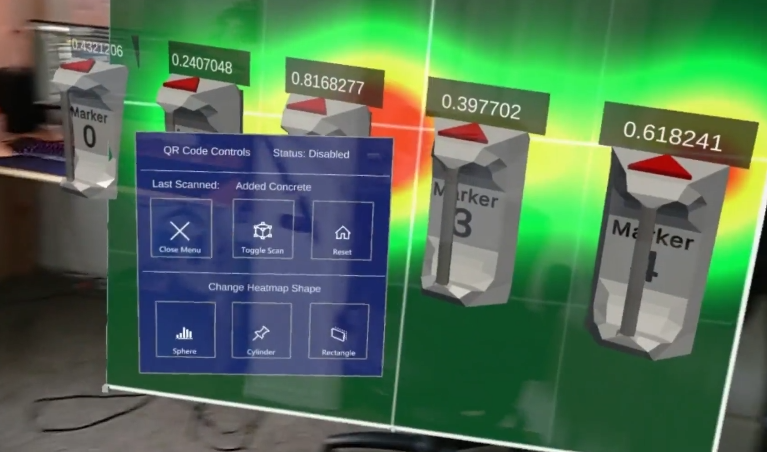
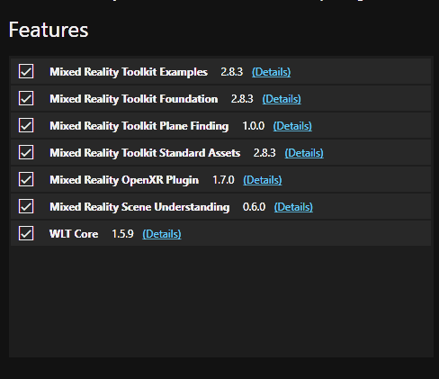
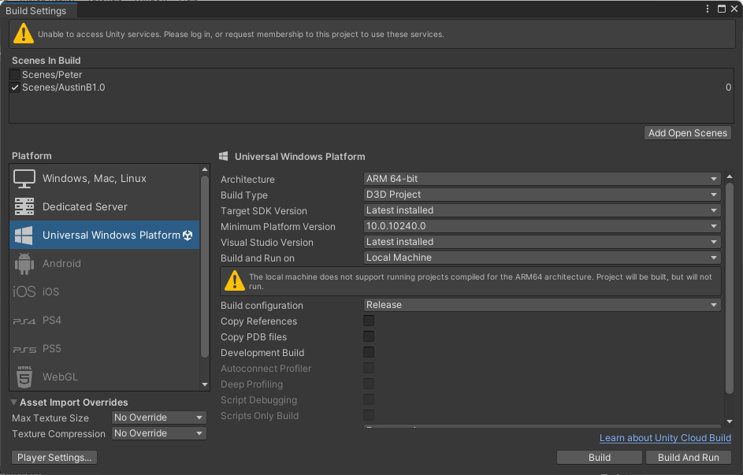
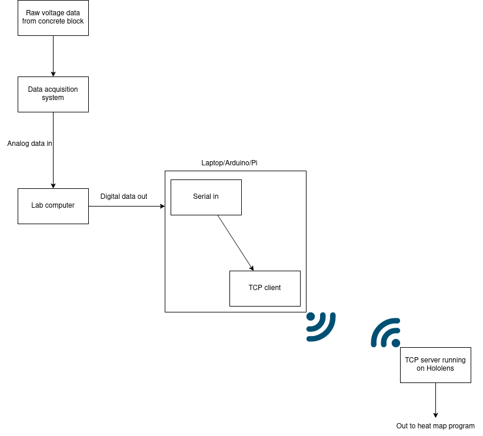

# Hololens Materials Stress Visualisation

## Authors
- Austin Friedrich
- Dietrich Lachmann
- Peter LaMontagne
- Henri Pierre

## Introduction
This project aims to create a real time physics visualization application. The goal is to see the forces being applied to a building or 
structure in real time as it is tested in a structural testing lab. This would be achieved by putting on a pair of Augmented Reality (AR) 
goggles and seeing the forces represented on top of a real world object. AR goggles have the ability to draw computer graphics on top of 
a user's view of the outside world. The forces will be represented via color, allowing the user to easily see which parts of the building 
are under stress at any given time.

## Screenshots

### Demo
A video demonstration can be accessed [here](https://media.oregonstate.edu/media/t/1_ddj6zb36)

## Purpose
This project exists so that the time between visualization and testing can be improved. Currently, engineers and researchers 
in the materials lab have to wait until after their test is completed to run the data through a computer visualization program. 
This means it is very difficult to get quick feedback about changes. To have live feedback of what is happening to the structure 
as it is happening will greatly improve the material research speed and give time back to the researchers and engineers to spend 
on more important tasks.

## Functionality
Currently the program works by syncing up a raspberry pi to the lab computer that is taking in live serial data from the testing 
environment. The data is sent through a wireless TCP connection from the pi to the hololens, read by the hololens, and output onto 
an AR data representation (heatmap and numerical values) overlaid onto the object being tested  

This means there are two distinct components to this project: a Unity project and a C TCP Client program. Both of these components 
need to be run simultaneously at the same time for the project to work. They do not need to be turned on in any particular order. 
Once the Unity project starts to receive server data, it will correctly place the number of sensors in the AR world and start applying 
the data to the heatmap.

## Usage 
### Get Started with Unity
(Requires Hololens)

1. Download and run Export_Beta_0.1.unitypackage 

**Or**

Manual Option:
1. Install Unity version: 2021.3.18f1 
2. Install Visual Studio with the correct dependencies according to [this](https://learn.microsoft.com/en-us/windows/mixed-reality/develop/install-the-tools#installation-checklist).
2. Download the Unity Files from [here](https://drive.google.com/file/d/1LzIgh8ygWYbkyFkig1FuCX5lFI8wVHlr/view?usp=share_link)
3. Unity Dependencies:
  1. NuGet Addon:
     1. NuGet Unity Integration: https://github.com/GlitchEnzo/NuGetForUnity
  2. NuGet Plugin packages:
     1. Microsoft.MixedReality.QR
     2. Microsoft.VCRTForwarders.140
  3. MRTK Version 2
      1. Using the MRTK feature tool, point it to the project directory and press “Restore Features”
      2. Alternatively, install these features 

3. At this point, the project should run directly in the editor
4. Build to a folder with these settings 

5. Open the folder, and open “AR_CS_Structural_Testing.sln”
6. Go to the “Project” tab, and select “AR_CS_Structural_Testing Properties”
7. In the “Debugging” tab, change the “Machine Name” to the IP Address of your HoloLens
8. Ensure your HoloLens is powered on and click the Play button in VS
  1. This will build and deploy to the HoloLens
  2. Once the project is deployed, it can be re-launched from the HoloLens directly
9. The Unity side of the project is now up and running. Once the server is launched (see below), the project will work

## Get Started with Client Side Driver Software
1. The driver software for the data collection/transmission program requires linux as well as the following dependencies
   1. stdio.h
   2. stdlib.h
   3. string.h
   4. stdbool.h
   5. fcntl.h
   6. errno.h
   7. termios.h
   8. unistd.h
   9. poll.h
2. Compile the program. Any C compiler should work, but gcc was used during the development of this product
3. To get the serial in, we used an RS-232 - USB cable

## Documentation/Help
### Unity Project Documentation
The files in the “Scripts” folder in Unity contain the code used for this project. Each of these scripts is independently documented 
with their purpose. The following diagram shows the general relationship between the scripts in Unity:

### Server Documentation
The following shows the general functionality of the C script:

### Oustide Documentation
The following pieces of documentation were references in making this project:  

- Install MRTK into Unity: https://learn.microsoft.com/en-us/windows/mixed-reality/develop/unity/welcome-to-mr-feature-tool
- MRTK Guide: https://learn.microsoft.com/en-us/windows/mixed-reality/develop/unity/unity-development-overview?tabs=arr%2CD365%2Chl2
- Deploying to HoloLens:  https://learn.microsoft.com/en-us/windows/mixed-reality/develop/advanced-concepts/using-visual-studio?tabs=hl2
- Using HoloLens Device Portal: https://learn.microsoft.com/en-us/windows/mixed-reality/develop/advanced-concepts/using-the-windows-device-portal
- QR Code Tracking Overview: https://learn.microsoft.com/en-us/windows/mixed-reality/develop/advanced-concepts/qr-code-tracking-overview#whats-the-accuracy
- QR Code Tracking Example: https://github.com/microsoft/MixedReality-QRCode-Sample
- Another QR Code Tracking Example: https://codeholo.com/2022/08/15/reading-json-input-with-hololens2-bonus-qr-code-alignment-on-a-real-world-object-with-open-xr-and-mrtk-v2-8/
- Daqbook User Manual: https://www.mccdaq.com/pdfs/manuals/daqbook2000_daqoem2000.pdf
- TTY Flow Control: http://uw714doc.sco.com/en/SDK_sysprog/_TTY_Flow_Control.html

## Contact 
Please contact us with any issues regarding this project. Feel free to open a GitHub issue or contact us directly:
- Dietrich Lachmann: dietrichplachmann@gmail.com
- Peter LaMontagne hololens@peterlamontagne.com
- Henri - hjtpierre@gmail.com 
- Austin friedrich- Austin.t.friedrich@gmail.com

